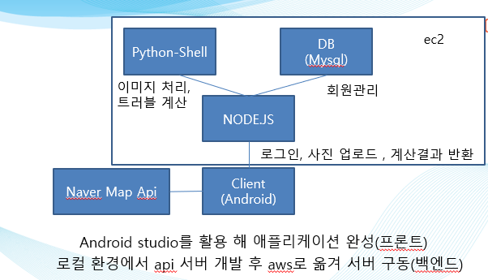
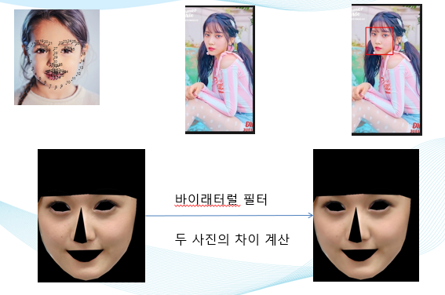
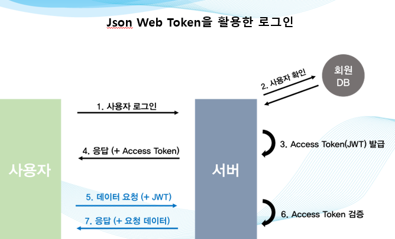

# SkinCareApp
피부 상태를 체크하는 안드로이드 애플리케이션입니다.


## 설치 방법

### Android

현재 스토어에 올라가 있지 않으므로 직접 Android studio를 설치해서 폰에 직접 빌드하셔야 합니다. 

이후 ip주소 변경

### Node

Node.js가 설치되어있어야 합니다.
추가로 dlib 실행을 위한파일을 backend폴더안에 넣어야합니다
https://github.com/AKSHAYUBHAT/TensorFace/blob/master/openface/models/dlib/shape_predictor_68_face_landmarks.dat

```
npm install 
```
## 프로젝트 구조



## 이미지 프로세싱 



## JWT



## 시연 영상

[](https://youtu.be/kDOSTNC5KGI)
